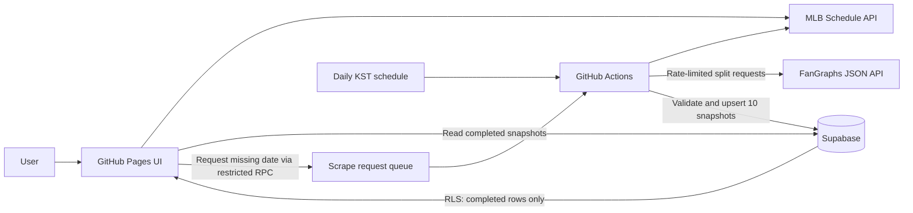
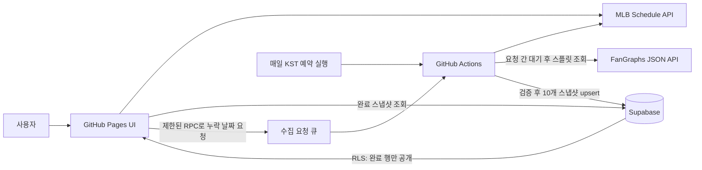

<details>
<summary>ENG (English Version)</summary>

# MLB Matchup Intelligence Dashboard

> An automated baseball data pipeline and interactive dashboard that turns game schedules and split statistics into a single pre-game decision-support view.

## Project at a Glance

| Category          | Details                                                                                                    |
| ----------------- | ---------------------------------------------------------------------------------------------------------- |
| Product           | MLB matchup analysis web application                                                                       |
| Core value        | Compare starters, bullpen leverage performance, pitcher availability, and recent hitting form in one place |
| Data sources      | MLB Schedule API, FanGraphs split leaderboards API                                                         |
| Frontend          | HTML, CSS, Vanilla JavaScript, Chart.js                                                                    |
| Data pipeline     | Python standard library, GitHub Actions                                                                    |
| Backend & storage | Supabase Postgres, PostgREST, Row Level Security                                                           |
| Deployment model  | GitHub Pages + scheduled/on-demand GitHub Actions                                                          |
| Validation        | 46 automated tests passing                                                                                 |

## Overview

Pre-game MLB analysis often requires moving between schedule pages and multiple split-stat leaderboards. Each source has different filters, date windows, team codes, and table layouts, making a consistent comparison slow and error-prone.

This project consolidates that workflow. A user selects a date and game, and the dashboard presents ten analysis tables covering both teams: starting-pitcher matchups, recent starter form, high/medium/low-leverage relievers, unavailable pitchers, and recent batting leaders. Hover interactions turn selected statistics into side-by-side Chart.js comparisons.

Despite the product title, the current scope is a **matchup intelligence dashboard**, not a machine-learning prediction model. Its purpose is to provide reliable, structured evidence that can support a prediction or pre-game decision.

## Problem and Approach

### 1. Static hosting cannot safely collect and write data

GitHub Pages has no trusted server runtime and cannot protect a database write key. Running collection logic directly in the browser would also make results dependent on each user's session.

**Approach:** Separate presentation from collection. The browser only reads completed snapshots with a public key, while GitHub Actions performs collection and database writes with a server-only secret.

### 2. One matchup requires many differently filtered datasets

Starting pitchers, leverage relievers, unavailable pitchers, and hitters all require different FanGraphs splits and lookback windows.

**Approach:** Model the workflow as ten explicit table steps. Each collector builds its own query, normalizes the result, validates both teams, and stores a table-level JSON snapshot before the next step begins.

### 3. Partial data can be mistaken for a finished analysis

If a collection job fails halfway through, a user could otherwise see an incomplete table without knowing it.

**Approach:** Persist only snapshots marked `complete`, expose only completed snapshots through Row Level Security, track run status and completed steps, and show collection progress in the UI.

## Key Features

- Date navigation and calendar-based game selection using the MLB schedule feed
- Game cards with away/home teams, probable starters, and game state
- Ten automatically populated analysis tables per game
- Starting-pitcher opponent history and 30-day recent form
- High-, medium-, and low-leverage bullpen views for opponent history and 14-day form
- Detection of pitchers used in three games across the previous two days
- Seven-day batting leaders filtered by AVG, OBP, SLG, OPS, and RISP thresholds
- Multiple-player row rendering with merged team cells for readable bullpen comparisons
- Hover-based pitcher and batting comparison charts
- On-demand collection queue for dates with no stored snapshot
- Automatic polling and visible loading, progress, completion, and error states

## System Architecture



## Data Rules

| Analysis table        | Data window                   | Main logic                                                          |
| --------------------- | ----------------------------- | ------------------------------------------------------------------- |
| Starter vs. opponent  | March 1 to game day − 1       | Starting-pitcher split against the opposing team                    |
| Starter recent form   | Game day − 30 to game day − 1 | Recent G, IP, ERA, BB/9, AVG, OBP, SLG, OPS, and RISP               |
| Leverage vs. opponent | March 1 to game day − 1       | Relief pitchers split by high, medium, or low leverage and opponent |
| Leverage recent form  | Game day − 14 to game day − 1 | Recent relief performance by leverage level                         |
| Unavailable pitchers  | Game day − 2 to game day − 1  | Relief pitchers with more than two appearances, including IP        |
| Recent hitting        | Game day − 7 to game day − 1  | PA > 19; AVG ≥ .300, OBP ≥ .400, SLG ≥ .500, OPS ≥ .900             |
| Hitting with RISP     | Game day − 7 to game day − 1  | RISP split with PA > 6                                              |

## Engineering Highlights

### API-first collection

The collector translates legacy leaderboard filter URLs into requests for FanGraphs' public JSON endpoint. This avoids coupling scheduled jobs to browser rendering or brittle absolute XPath selectors. A random 1–3 second delay is applied before each source request, with validation restricting the configurable range to 1–5 seconds.

### Consistent normalization

- Maps opponent split identifiers for all 30 MLB teams
- Resolves source-specific aliases such as `ARZ`/`AZ`, `CHW`/`CWS`, and `WAS`/`WSH`
- Normalizes Unicode and whitespace before player-name matching
- Merges Standard, Advanced, and RISP results by normalized player name
- Calculates OPS from OBP + SLG and formats baseball rate statistics consistently

### Deterministic sequential pipeline

Each game runs through the same ten-step order. A step is collected, validated, and stored before the next begins. A failed step stops the remaining tables for that game, while other scheduled games continue; the overall run records any failures for diagnosis.

### Secure public delivery

- The browser receives only a Supabase publishable key
- Database writes are restricted to the GitHub Actions secret key
- Run history and error messages are not publicly readable
- Public policies expose only `complete` table snapshots
- A `SECURITY DEFINER` RPC accepts only a date, rejects future dates and dates older than 400 days, coalesces duplicate requests, and applies a retry cooldown

### Queue-based on-demand refresh

When a user selects a date without stored data, the frontend registers a narrowly scoped request in Supabase. A GitHub Actions job polls the oldest pending request every five minutes, while the page checks for newly completed snapshots every 30 seconds. A separate daily workflow prepares the next Korean-calendar day's games at 18:17 KST.

## Data Model

- `mlb_scrape_runs`: execution status, current game/table, completed steps, and failure details
- `mlb_game_table_snapshots`: one completed JSON payload per game and table, uniquely keyed by `game_pk + table_key`
- `mlb_scrape_requests`: deduplicated on-demand date queue with attempts and lifecycle timestamps

## Verification

The automated test suite contains **46 passing tests** and covers:

- Date-window and month-boundary calculations
- FanGraphs split and filter query construction
- Column mapping, OPS calculation, and rate formatting
- Unicode-aware player matching and MLB team aliases
- Hitting qualification thresholds
- Strict pipeline order and stop-on-failure behavior
- Continuation to later games after one game fails
- MLB schedule parsing and probable-starter extraction
- Queue claiming and attempt-count updates

Test command:

```bash
python -m unittest discover -s tests -v
```

## Implementation Result

- Converted a manual, multi-page research process into a repeatable end-to-end pipeline
- Unified ten matchup datasets behind one game-selection interface
- Kept privileged collection credentials out of the static frontend
- Made partial progress and failures observable instead of silently presenting incomplete data
- Built the collectors without third-party Python runtime dependencies

## Future Improvements

- Add recorded API fixtures and contract tests to detect upstream schema changes early
- Add end-to-end tests for the deployed page, queue, and Supabase integration
- Add run-level monitoring and alerts for repeated collection failures
- Add caching and request-volume metrics to tune collection latency
- Introduce an explainable prediction layer only after historical backtesting and leakage controls are defined

## [Web Page](https://lutetiumcalciumlee.github.io/Web_scraping_MLB_Project)

</details>

<details>
<summary>KOR (한국어 버전)</summary>

# MLB 매치업 인텔리전스 대시보드

> 경기 일정과 세부 스플릿 기록을 자동으로 수집해, 경기 전 분석에 필요한 정보를 한 화면에서 비교할 수 있도록 만든 MLB 데이터 파이프라인 및 인터랙티브 대시보드입니다.

## 프로젝트 한눈에 보기

| 구분        | 내용                                                 |
| --------- | -------------------------------------------------- |
| 제품        | MLB 경기 매치업 분석 웹 애플리케이션                             |
| 핵심 가치     | 선발투수, 불펜 레버리지, 투수 가용성, 최근 타격 흐름을 한 화면에서 비교         |
| 데이터 소스    | MLB Schedule API, FanGraphs split leaderboards API |
| 프런트엔드     | HTML, CSS, Vanilla JavaScript, Chart.js            |
| 데이터 파이프라인 | Python 표준 라이브러리, GitHub Actions                    |
| 백엔드·저장소   | Supabase Postgres, PostgREST, Row Level Security   |
| 배포 구조     | GitHub Pages + 예약·온디맨드 GitHub Actions              |
| 검증        | 자동화 테스트 46개 통과                                     |

## 프로젝트 개요

MLB 경기 전 분석을 하려면 일정 페이지와 여러 개의 스플릿 통계 화면을 오가야 합니다. 데이터마다 필터, 조회 기간, 팀 코드, 표 구조가 달라 같은 기준으로 양 팀을 비교하기 어렵고 수작업 오류도 발생하기 쉽습니다.

이 프로젝트는 해당 과정을 하나의 흐름으로 통합했습니다. 사용자가 날짜와 경기를 선택하면 양 팀의 선발 상대 전적, 선발 최근 성적, High/Medium/Low Leverage 불펜, 출전 불가 가능성이 높은 투수, 최근 타격 우수 선수를 포함한 10개 분석 표를 제공합니다. 주요 지표에 마우스를 올리면 Chart.js 기반 양 팀 비교 차트도 확인할 수 있습니다.

프로덕트 화면의 명칭은 ‘MLB 경기 예측’이지만, 현재 구현 범위는 머신러닝 예측 모델이 아니라 **예측과 경기 전 판단에 필요한 근거를 구조화하는 매치업 분석 대시보드**입니다.

## 문제 정의와 해결 방식

### 1. 정적 호스팅 환경에서는 안전한 수집·저장이 어렵다

GitHub Pages에는 신뢰할 수 있는 서버 런타임이 없고, 데이터베이스 쓰기 키를 브라우저에 노출할 수도 없습니다. 브라우저에서 직접 수집하면 사용자 세션과 네트워크 상태에 따라 결과도 달라집니다.

**해결:** 화면과 수집 책임을 분리했습니다. 브라우저는 공개 키로 완료된 스냅샷만 읽고, GitHub Actions가 서버 전용 비밀 키를 사용해 데이터 수집과 저장을 담당합니다.

### 2. 한 경기 분석에도 서로 다른 조건의 데이터가 필요하다

선발투수, 레버리지별 불펜, 출전 불가 투수, 타자는 각각 다른 FanGraphs 스플릿과 조회 기간을 사용합니다.

**해결:** 수집 과정을 10개의 명시적인 표 단계로 모델링했습니다. 각 수집기가 전용 쿼리를 생성하고 결과를 정규화한 뒤, 양 팀 데이터가 올바른지 검증하고 표 단위 JSON 스냅샷을 저장합니다.

### 3. 일부 데이터만 수집된 상태가 완성 결과처럼 보일 수 있다

수집이 중간에 실패하면 사용자는 불완전한 표를 정상 결과로 오해할 수 있습니다.

**해결:** `complete` 상태의 스냅샷만 저장·공개하고, RLS 정책으로 완료 데이터만 조회할 수 있게 했습니다. 실행 상태와 완료 단계를 별도로 기록하고, 화면에는 수집 진행률과 오류 상태를 표시합니다.

## 주요 기능

- MLB 일정 데이터를 이용한 날짜 이동, 달력, 경기 선택
- 원정·홈 팀, 예고 선발, 경기 상태를 표시하는 경기 카드
- 경기별 10개 분석 표 자동 구성
- 선발투수 상대 전적 및 최근 30일 성적 비교
- High·Medium·Low Leverage 불펜의 상대 전적 및 최근 14일 성적 비교
- 경기일 직전 이틀 동안 3경기 이상 등판한 투수와 IP 확인
- 최근 7일 AVG, OBP, SLG, OPS, RISP 기준 우수 타자 추출
- 불펜 다중 선수 행 추가 및 팀 셀 병합 렌더링
- 투수·타격 지표별 호버 비교 차트
- 저장 데이터가 없는 날짜의 온디맨드 수집 요청 큐
- 자동 폴링과 로딩·진행·완료·오류 상태 안내

## 시스템 아키텍처



## 데이터 규칙

| 분석 표       | 조회 기간              | 핵심 로직                                                   |
| ---------- | ------------------ | ------------------------------------------------------- |
| 선발 상대 전적   | 3월 1일 ~ 경기일 전날     | 상대 팀 스플릿을 적용한 선발투수 기록                                   |
| 선발 최근 성적   | 경기일 30일 전 ~ 경기일 전날 | G, IP, ERA, BB/9, AVG, OBP, SLG, OPS, RISP              |
| 레버리지 상대 전적 | 3월 1일 ~ 경기일 전날     | High·Medium·Low Leverage 및 상대 팀 스플릿                     |
| 레버리지 최근 성적 | 경기일 14일 전 ~ 경기일 전날 | 레버리지 단계별 최근 불펜 성적                                       |
| 출전 불가 투수   | 경기일 2일 전 ~ 경기일 전날  | 등판 경기 수가 2보다 큰 불펜 투수와 IP                                |
| 최근 타격      | 경기일 7일 전 ~ 경기일 전날  | PA > 19, AVG ≥ .300, OBP ≥ .400, SLG ≥ .500, OPS ≥ .900 |
| 득점권 타격     | 경기일 7일 전 ~ 경기일 전날  | RISP 스플릿 및 PA > 6                                       |

## 핵심 구현 내용

### API 중심 수집 구조

기존 리더보드 URL의 필터를 FanGraphs 공개 JSON 엔드포인트 요청으로 변환했습니다. 덕분에 예약 작업이 브라우저 렌더링이나 깨지기 쉬운 절대 XPath에 의존하지 않습니다. 각 소스 요청 전 1~3초의 무작위 대기 시간을 적용하고, 설정 가능한 범위도 1~5초 안으로 제한했습니다.

### 일관된 데이터 정규화

- MLB 30개 팀의 상대 팀 스플릿 ID 매핑
- `ARZ`/`AZ`, `CHW`/`CWS`, `WAS`/`WSH` 등 소스별 팀 코드 차이 보정
- 선수명 비교 전 유니코드와 연속 공백 정규화
- 선수명을 기준으로 Standard, Advanced, RISP 결과 병합
- OBP + SLG로 OPS를 계산하고 야구 비율 지표 형식을 일관되게 변환

### 결정적인 순차 파이프라인

각 경기는 항상 동일한 10단계 순서로 처리됩니다. 한 단계를 수집·검증·저장한 후에만 다음 단계가 시작됩니다. 특정 경기에서 한 단계가 실패하면 그 경기의 이후 표는 중단하지만 다른 경기는 계속 처리하고, 전체 실행 결과에는 실패 원인을 남깁니다.

### 정적 사이트에 맞춘 보안 설계

- 브라우저에는 Supabase publishable key만 제공
- 쓰기 작업은 GitHub Actions의 서버 전용 secret key로 제한
- 실행 이력과 오류 메시지는 공개 조회 차단
- `complete` 상태인 표 스냅샷만 공개하는 RLS 정책 적용
- `SECURITY DEFINER` RPC는 날짜 하나만 입력받고, 미래 날짜와 400일보다 오래된 날짜를 거부하며, 중복 요청 병합 및 재요청 쿨다운 적용

### 큐 기반 온디맨드 갱신

저장된 데이터가 없는 날짜를 선택하면 프런트엔드가 Supabase에 제한된 수집 요청을 등록합니다. GitHub Actions는 5분마다 가장 오래된 대기 요청을 처리하고, 페이지는 30초 간격으로 완료 스냅샷을 확인합니다. 별도의 일일 작업은 한국시간 18시 17분에 다음 날 경기를 미리 수집합니다.

## 데이터 모델

- `mlb_scrape_runs`: 실행 상태, 현재 경기·표, 완료 단계, 실패 원인 기록
- `mlb_game_table_snapshots`: `game_pk + table_key`를 고유 키로 사용하는 표 단위 완료 JSON 스냅샷
- `mlb_scrape_requests`: 시도 횟수와 상태 변경 시각을 포함한 중복 방지 날짜 요청 큐

## 테스트 및 검증

자동화 테스트 **46개가 모두 통과**했으며 다음 내용을 검증합니다.

- 조회 기간 및 월 경계 날짜 계산
- FanGraphs 스플릿·필터 쿼리 생성
- 통계 열 매핑, OPS 계산, 비율 지표 포맷
- 유니코드 선수명 비교 및 MLB 팀 별칭 처리
- 타격 지표별 기준 충족 선수 추출
- 파이프라인 순서와 실패 시 이후 단계 중단
- 한 경기 실패 후 다음 경기 처리 지속
- MLB 일정 및 예고 선발 파싱
- 요청 큐 선점과 시도 횟수 갱신

테스트 실행 명령:

```bash
python -m unittest discover -s tests -v
```

## 구현 결과

- 여러 페이지를 오가던 수작업 조사 과정을 반복 가능한 엔드투엔드 파이프라인으로 전환
- 서로 다른 조건의 10개 매치업 데이터를 하나의 경기 선택 화면에 통합
- 정적 프런트엔드에서 권한이 높은 수집 자격 증명을 완전히 분리
- 일부 완료와 실패 상태를 숨기지 않고 사용자가 확인할 수 있도록 설계
- 서드파티 Python 런타임 의존성 없이 수집기 구현

## 향후 개선 방향

- 기록된 API fixture와 contract test를 추가해 외부 스키마 변경을 조기에 감지
- 배포 페이지·요청 큐·Supabase를 연결하는 E2E 테스트 추가
- 반복 수집 실패에 대한 실행 단위 모니터링과 알림 구축
- 캐시 및 요청량 지표를 기반으로 전체 수집 시간 최적화
- 충분한 과거 데이터 백테스트와 데이터 누수 방지 기준을 마련한 뒤 설명 가능한 예측 계층 도입

## [웹페이지](https://lutetiumcalciumlee.github.io/Web_scraping_MLB_Project)

</details>
